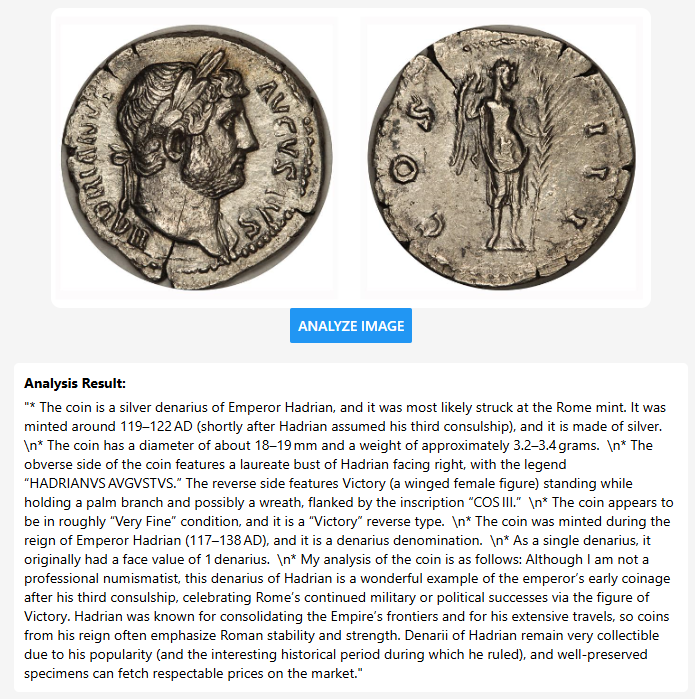

# Overview
This project is a demonstration on how to use Azure OpenAI. It takes an uploaded image of a Roman Imperial Coin and analyzes it Azure OpenAI
using the [Azure OpenAI Service](https://learn.microsoft.com/en-us/azure/cognitive-services/openai/overview?tabs=python) and the 'gpt-4-turbo' model. The application is built using a microservices architecture and deployed to Azure Kubernetes Service (AKS) with Azure Static Web Apps (SWA) for the front end.

## Example 
| o1 Analysis | GTP-4 Analysis |
| ----------- | --------------- |
|  |  |

(<a href="#Introduction">Back to Top</a>)

## Components
Component | Usage
------ | ------
Azure Kubernetes Service | Container Orchestration Runtime Platform  
Azure Blob Storage | Image Storage 
Azure AI Foundry Service | Hosts the LLM to analyze the coin
Azure Static Web Apps | Hosting platform for React Native UI
Azure Key Vault | Secret store 
Azure Container Registry | Container Registry for Docker Images
Azure Grafana | Monitoring and Observability
Azure Application Insights | Monitoring and Observability
Azure Managed Prometheus | Monitoring and Observability
Azure APIM Managment | API Gateway 

(<a href="#Introduction">Back to Top</a>)

# Architecture

(<a href="#Introduction">Back to Top</a>)

## Design Questions and Challenges
* :question: What are some ways to improve the performance of the application?
* :question: How can we ensure the security of the application?
* :question: Azure WAF for AI applications recommends placing an Azure API Management (APIM) in front of the Azure OpenAI Service. How can we implement this - should this differ than the current APIM deployed?
* :question: Calls to Azure OpenAI can take a long time to process. How can we leverage other services such as Azure WebPub improve responsiveness of the application?

# Setup
* The environment can setup following the steps in the [Setup and Deployment](./docs/setup.md) document.  
* The setup process will create all the required resources and deploy the application code to Azure.

(<a href="#Introduction">Back to Top</a>)

# Roadmap
- [x] DevContainers
- [x] Helm Chart Updates
- [x] APIM Configuration and API Policies 
- [x] Simple React Front End 
- [x] ACR Container Build Task
- [x] Deployment to SWA
- [x] Deployment to AKS
- [x] End to End Testing
- [x] Architecture Diagram
- [x] Updated Documentation
- [x] Update to AI Foundry 
- [x] Update to Agent Framework SDK
- [ ] Move to Multi-agent Concurrent workflow example - Agent Service Connected Agents
- [ ] Move to Multi-agent Concurrent workflow example - YAML defined agents
- [ ] Implement Check Status and Return Results Methods
- [ ] Add tracing to App Insights 

(<a href="#Introduction">Back to Top</a>)

# Navigation
 [Return to Main Index 🏠](./README.md) ‖ [Next Section ⏩](./docs/setup.md) 

(<a href="#Introduction">Back to Top</a>)

