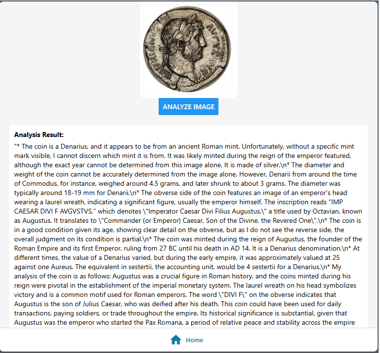

# Overview
TBD

## Components
Component | Usage
------ | ------
Azure Kubernetes Service | Container Orchestration Runtime Platform  
Azure Blob Storage | Podcast Storage 
Azure OpenAI Service Services | Service that analyze the coin
Azure Static Web Apps | Hosting platform for React UI
Azure Key Vault | Secret store 
Azure APIM Managment | API Gateway 

# Architecture
TBD

# Deployment

## Codespaces
> You can use the following link to launch a Codespaces configured for this project:

  

## Prerequisites
* A Posix compliant System. It could be one of the following:
    * [Github CodeSpaces](https://github.com/features/codespaces)
    * Azure Linux VM - Standard_B1s VM will work ($18/month)
    * Windows 11 with [Windows Subsystem for Linux](https://docs.microsoft.com/en-us/windows/wsl/install)
* [dotnet 9](https://dotnet.microsoft.com/download) - The .NET Platform
* [Visual Studio Code](https://code.visualstudio.com/) or equivalent - A lightweight code editor
* [Docker](https://www.docker.com/products/docker-desktop) - The Docker Desktop to build/push containers
* [Azure CLI](https://docs.microsoft.com/en-us/cli/azure/install-azure-cli) - A tool for managing Azure resources
* [git](https://git-scm.com/) - The source control tool
* [Taskfile](https://taskfile.dev/#/) - A task runner for the shell
* [Terraform](https://www.terraform.io/) - A tool for building Azure infrastructure and infrastructure as code
* A public domain that you can create DNS records
* [Required Certificates](./docs/letsencrypt.md)

* The following DNS records are required for the application to work correctly.  These are used for the application to be accessed externally.  The following records are required: 
    Name | Usage | DNS Record Type | IP Address
    ------ | ---- | ---- | ----
    ric.bjd.demo | APIM Gateway | A | APIM Gateway IP Address in West US
    

(<a href="#Introduction">Back to Top</a>)

## Task
* The deployment of this application has been automated using [Taskfile](https://taskfile.dev/#/).  This was done instead of using a CI/CD pipeline to make it easier to understand the deployment process.  
* Of course, the application can be deployed manually
* The Taskfile is a simple way to run commands and scripts in a consistent manner.  
* The [Taskfile](../Taskfile.yaml) definition is located in the root of the repository
* The Task file declares the default values that can be updated to suit specific requirements: 

### Taskfile Variables

Name | Usage | Location | Required | Default or Example Value
------ | ------ | ------ | ------ | ------
TITLE | Value used in Azure Tags | taskfile.yaml | Yes | CQRS Multi-region Pattern in Azure
DEFAULT_REGIONS | Default region to deploy to | taskfile.yaml | Yes | ["westus3"]
DOMAIN_ROOT | Default root domain used for all URLs & certs | taskfile.yaml | Yes | bjd.demo

### Task Commands
* Running the `task` command without any options will run the default command. This will list all the available tasks.
    * `task up`                 : Builds complete environment
    * `task down`               : Destroys all Azure resources and cleans up Terraform
    * `task apply`              : Applies the Terraform configuration for the core components
    * `task build`              : Builds containers and pushes to Azure Container Registry
    * `task deploy`             : Creates application components and deploy the application code
    * `task ui`                 : Deploys Blazor UI components to Azure Static Web Apps

(<a href="#Introduction">Back to Top</a>)

# Roadmap
- [X] DevContainers
- [X] Helm Chart Updates
- [X] APIM Configuration and API Policies 
- [X] Simple React Front End 
- [X] ACR Container Build Task
- [X] Deployment to SWA
- [X] Deployment to AKS
- [x] End to End Testing
- [ ] Architecture Diagram
- [ ] Updated Documentation
- [ ] Update API to save image to blob storage and return URL in response
- [ ] Update Front End to display image

# Setup
[Return to Main Index 🏠](../README.md)  ‖ [Next Section ⏩](./docs/letsencrypt.md)

(<a href="#Introduction">Back to Top</a>)
