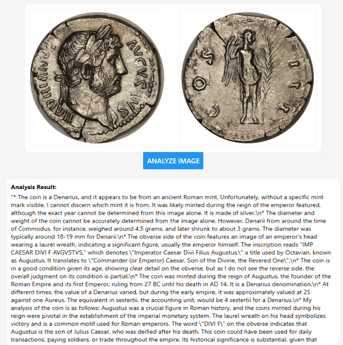
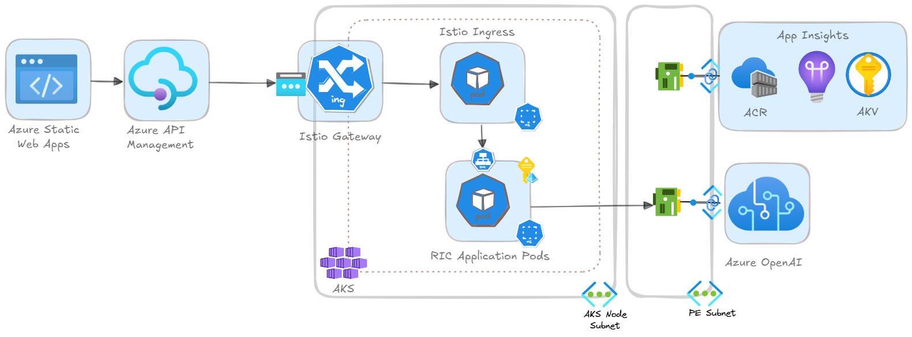

# Overview
This project is a demostration on how to use Azure OpenAI. It takes an uploaded image of a Roman Imperial Coin and analyzes it Azure OpenAI
using the [Azure OpenAI Service](https://learn.microsoft.com/en-us/azure/cognitive-services/openai/overview?tabs=python). The application is built using a microservices architecture and deployed to Azure Kubernetes Service (AKS) with Azure Static Web Apps (SWA) for the front end.

## Example Analysis 

(<a href="#Introduction">Back to Top</a>)

## Components
Component | Usage
------ | ------
Azure Kubernetes Service | Container Orchestration Runtime Platform  
Azure Blob Storage | Podcast Storage 
Azure OpenAI Service | Service that analyze the coin
Azure Static Web Apps | Hosting platform for React Native UI
Azure Key Vault | Secret store 
Azure Container Registry | Container Registry for Docker Images
Azure Grafana | Monitoring and Observability
Azure Application Insights | Monitoring and Observability
Azure Managed Prometheus | Monitoring and Observability
Azure APIM Managment | API Gateway 

(<a href="#Introduction">Back to Top</a>)

# Architecture

(<a href="#Introduction">Back to Top</a>)

# Setup
* The environment can setup following the steps in the [Setup and Deployment](./docs/setup.md) document.  
* The setup process will create all the required resources and deploy the application code to Azure.

(<a href="#Introduction">Back to Top</a>)

# Roadmap
- [x] DevContainers
- [x] Helm Chart Updates
- [x] APIM Configuration and API Policies 
- [x] Simple React Front End 
- [x] ACR Container Build Task
- [x] Deployment to SWA
- [x] Deployment to AKS
- [x] End to End Testing
- [x] Architecture Diagram
- [ ] Updated Documentation
- [ ] Update API to save image to blob storage and return URL in response
- [ ] Update Front End to display image
- [ ] Update Front End to display details of the OpenAI calls

(<a href="#Introduction">Back to Top</a>)

# Navigation
 [Return to Main Index 🏠](./README.md) ‖ [Next Section ⏩](./docs/setup.md) 

(<a href="#Introduction">Back to Top</a>)

