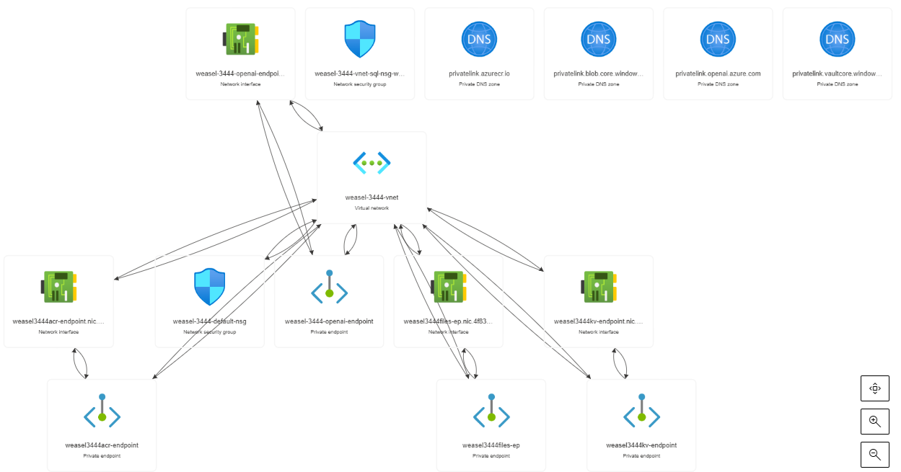
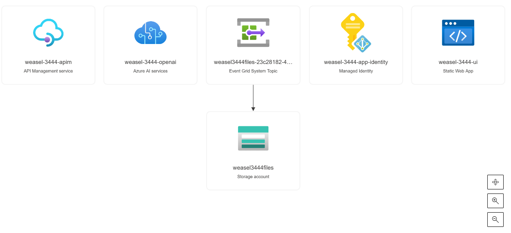
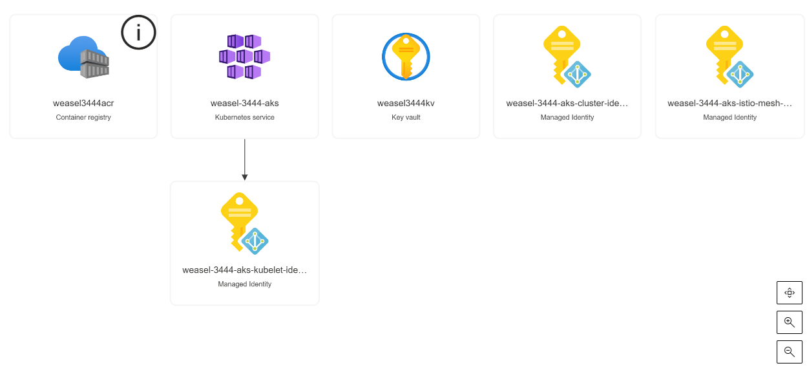
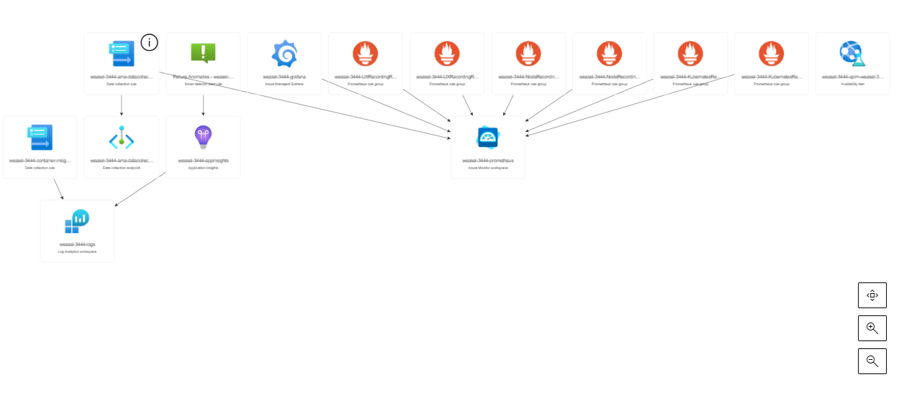

Infrastructure
============
* The infrastructure is deployed to Azure using Terraform.  
* Terraform will generate a random name that is used as the foundation for all the resources created in Azure.  
    * The random name is generated using the `random_pet` and `random_integer` resources in Terraform.  
    * This value should be saved as it is used throughout the deployment. 
    * The example name `weasel-3444` is used in the rest of the documents
* The infrastructure deploy can take up to 30 minutes to complete.
* The `cert` step will create/switch to a branch in your GitHub repository named after the application name generated by Terraform.
* The infrastructure will deploy the 'gpt-4-turbo' model for image analysis.

# Steps
## :heavy_check_mark: Deploy Task Steps
> _**Note**: If terraform fails for any resaon, you can run these commands individually to retry the deployment._
- :one: `task init`         - Initializes the Terraform environment for the Roman Imperial Coin Analyzer
- :two: `task apply`        - Applies the Terraform configuration for the Roman Imperial Coin Analyzer
- :three: `task creds`      - Gets the AKS credentials for the newly created AKS cluster
- :four: `task: core`      - Configures the Istio Gateway with a TLS certificate from Azure Key Vault
- :five: `task dns`         - Gets the IP Address of the Istio Gateway
- :six: **MANUAL STEP**     - Create DNS records with your DNS provider
- :seven: **MANUAL STEP**   - Import the [API swagger file into APIM API](./swagger.md)

### Example Deployment Steps
```bash
➜  openai-coin-analyzer git:(main) ✗ task apply
task: [up] terraform -chdir=./infrastructure workspace new westus || true
Created and switched to workspace "westus"!

You're now on a new, empty workspace. Workspaces isolate their state,
so if you run "terraform plan" Terraform will not see any existing state
for this configuration.
task: [up] terraform -chdir=./infrastructure workspace select westus
task: [up] terraform -chdir=./infrastructure init
...
data.http.myip: Reading...
data.http.myip: Read complete after 1s [id=http://checkip.amazonaws.com/]
data.azurerm_subscription.current: Reading...
data.azurerm_client_config.current: Reading...
data.azurerm_client_config.current: Read complete after 0s [id=Y2xpZW50Q29uZmlncy9jbGllbnRJZD0wNGIwNzc5NS04ZGRiLTQ2MWEtYmJlZS0wMmY5ZTFiZjdiNDY7b2JqZWN0SWQ9Y2QzY2JhZjEtOWI3YS00YjFhLTllMTktYTEzYTYzMGI4OGZlO3N1YnNjcmlwdGlvbklkPWNjZmM1ZGRhLTQzYWYtNGI1ZS04Y2MyLTFkZGExOGYyMzgyZTt0ZW5hbnRJZD0xNmIzYzAxMy1kMzAwLTQ2OGQtYWM2NC03ZWRhMDgyMGI2ZDM=]
data.azurerm_subscription.current: Read complete after 0s [id=/subscriptions/ccfc5dda-43af-4b5e-8cc2-1dda18f2382e]

Terraform used the selected providers to generate the following execution plan. Resource actions are indicated with the following symbols:
  + create
 <= read (data resources)

Terraform will perform the following actions:

  # data.azurerm_kubernetes_cluster.this will be read during apply
  # (config refers to values not yet known)
 <= data "azurerm_kubernetes_cluster" "this" {
      + aci_connector_linux                              = (known after apply)
      + agent_pool_profile                               = (known after apply)
...
azurerm_private_endpoint.key_vault: Still creating... [40s elapsed]
azurerm_private_endpoint.acr_account: Still creating... [40s elapsed]
azurerm_private_endpoint.acr_account: Still creating... [50s elapsed]
azurerm_private_endpoint.key_vault: Still creating... [50s elapsed]
azurerm_private_endpoint.key_vault: Creation complete after 56s [id=/subscriptions/ccfc5dda-43af-4b5e-8cc2-1dda18f2382e/resourceGroups/weasel-3444-infra_rg/providers/Microsoft.Network/privateEndpoints/weasel3444kv-endpoint]
azurerm_private_endpoint.acr_account: Creation complete after 56s [id=/subscriptions/ccfc5dda-43af-4b5e-8cc2-1dda18f2382e/resourceGroups/weasel-3444-infra_rg/providers/Microsoft.Network/privateEndpoints/weasel3444acr-endpoint]

Apply complete! Resources: 10 added, 4 changed, 2 destroyed.

Outputs:

ACR_NAME = "weasel3444acr"
AKS_CLUSTER_NAME = "weasel-3444-aks"
AKS_RESOURCE_GROUP = "weasel-3444-aks_rg"
APIM_GATEWAY = "https://weasel-3444-apim.azure-api.net/api/analyze"
APIM_SUBSCRIPTION_ID = <sensitive>
APP_INSIGHTS = <sensitive>
APP_NAME = "weasel-3444"
APP_RESOURCE_GROUP = "weasel-3444-app_rg"
AZURE_STATIC_WEBAPP_NAME = "weasel-3444-ui"
ISTIO_CLIENT_ID = "ff964488-5541-4265-a395-b587349d9212"
ISTIO_TENANT_ID = "16b3c013-d300-468d-ac64-7eda0820b6d3"
KEYVAULT_NAME = "weasel3444kv"
OPENAI_ENDPOINT = "https://weasel-3444-openai.openai.azure.com/"
WORKLOAD_CLIENT_ID = "9b98e3e7-5e12-4a12-b377-7b3349cd4939"
WORKLOAD_ID_NAME = "weasel-3444-app-identity"
WORKLOAD_TENANT_ID = "16b3c013-d300-468d-ac64-7eda0820b6d3"
➜  openai-coin-analyzer git:(main) ✗ 
```

```bash
➜  openai-coin-analyzer git:(main) ✗ task creds
task: [creds] az aks get-credentials -g weasel-3444-aks_rg -n weasel-3444-aks --overwrite-existing
task: [creds] sed -i s/devicecode/azurecli/g ~/.kube/config
➜  openai-coin-analyzer git:(main) ✗ 
```

```bash
➜  openai-coin-analyzer git:(main) ✗ task core
task: [branch] git branch weasel-3444 2>>/dev/null || true
task: [branch] git checkout weasel-3444
Switched to branch 'weasel-3444'
task: [core] helm template ric-analyzer --set APP.TAG_NAME=weasel-3444 --set ISTIO.CLIENT_ID=ff964488-5541-4265-a395-b587349d9212 --set ISTIO.TENANT_ID=16b3c013-d300-468d-ac64-7eda0820b6d3 --set ISTIO.KEYVAULT_NAME=zebra2141kv --set APP_INSIGHTS.CONNECTION_STRING="InstrumentationKey=REDACTED;IngestionEndpoint=https://westus-0.in.applicationinsights.azure.com/;LiveEndpoint=https://westus.livediagnostics.monitor.azure.com/;ApplicationId=REDACTED" ./charts/infra > ./cluster-config/infrastructure/components.yaml
task: [core] git add ./cluster-config/infrastructure/components.yaml || true
task: [core] git commit -m "[Fri Mar  7 10:28:49 CST 2025] - Updates for weasel-3444 infra 🖥️ certificates" || true
[weasel-3444 7d301d2] [Fri Mar  7 10:28:49 CST 2025] - Updates for weasel-3444 infra 🖥️ certificates
 1 file changed, 181 insertions(+)
task: [core] git push --set-upstream origin weasel-3444 || true
Enumerating objects: 9, done.
Counting objects: 100% (9/9), done.
Delta compression using up to 8 threads
Compressing objects: 100% (5/5), done.
...
task: [core] git checkout main
➜  openai-coin-analyzer git:(main) ✗ 
```

```bash
➜  openai-coin-analyzer git:(main) ✗ task dns
➡️The Azure APIM Backend ric.bjd.demo should resolve to 5.5.5.x
➜  openai-coin-analyzer git:(main) ✗ 
```
<p align="right">(<a href="#Infrastructure">back to top</a>)</p>

Created Resources 
============
## Core Resources

<p align="right">(<a href="#Infrastructure">back to top</a>)</p>

## Application Resources

<p align="right">(<a href="#Infrastructure">back to top</a>)</p>

## AKS Resources

<p align="right">(<a href="#Infrastructure">back to top</a>)</p>

## Monitoring Resources

<p align="right">(<a href="#Infrastructure">back to top</a>)</p>

# Navigation
[⏪ Previous Section](../docs/letsencrypt.md) ‖ [Return to Main Index 🏠](../README.md) ‖ [Next Section ⏩](../docs/code.md) 
<p align="right">(<a href="#Infrastructure">back to top</a>)</p>