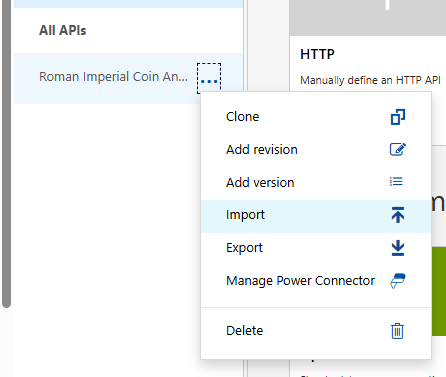
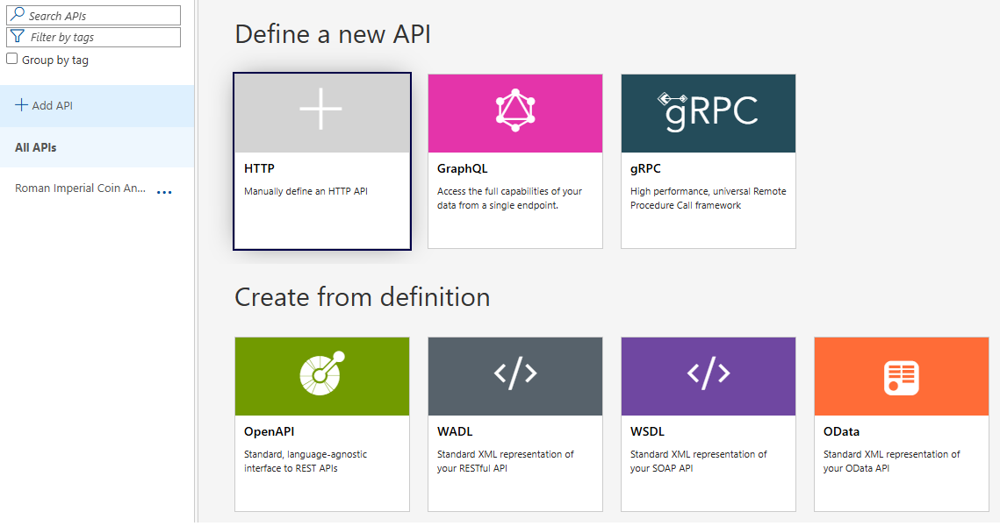
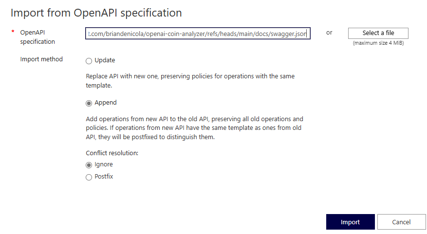
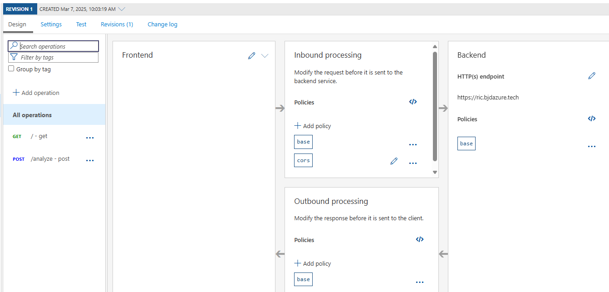

API Management
=============
* The API definition is defined in the `swagger.json` file. 
* The Terraform module for APIM APIs can import the swagger.json from an URL but I have continually received errors while trying to do this.
* The following steps are a workaround to import the swagger.json file into APIM.
* The swagger.json file is located in the `docs` folder of the repository or at this [location](https://raw.githubusercontent.com/briandenicola/openai-coin-analyzer/refs/heads/main/docs/swagger.json)

# Steps
* Log into the Azure Portal and navigate to the API Management service.
* Select the APIs tab on the left hand side.
* Hover over '...' of the 'Roman Imperial Coin' Api.
* Select 'Import' from the dropdown.
* 

(<a href="#api-management">Back to Top</a>)

## Step 1
* Select OpenAPI
* 

(<a href="#api-management">Back to Top</a>)

## Step 2
* Provide the URL for the [Swagger.json](https://raw.githubusercontent.com/briandenicola/openai-coin-analyzer/refs/heads/main/docs/swagger.json) file or upload the file from your local machine.
* Select 'Append'
* Click 'Import'
* 

(<a href="#api-management">Back to Top</a>)

## Step 2b
* Check the backend URL for the correct API. The import might have changed the URL from the default APIM URL to GitHub URL. 
* Confirm its https://ric.${DEFAULT_DOMAIN_NAME}

(<a href="#api-management">Back to Top</a>)

# Result

(<a href="#api-management">Back to Top</a>)

# Navigation
[⏪ Previous Section](../docs/infrastructure.md#steps) ‖ [Return to Main Index 🏠](../README.md) 