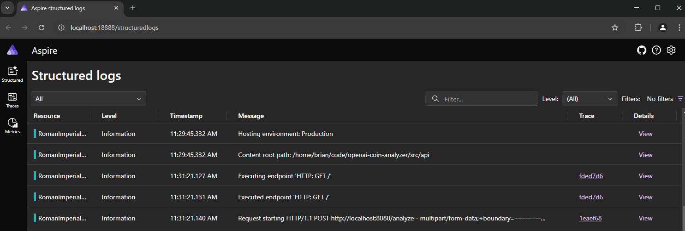
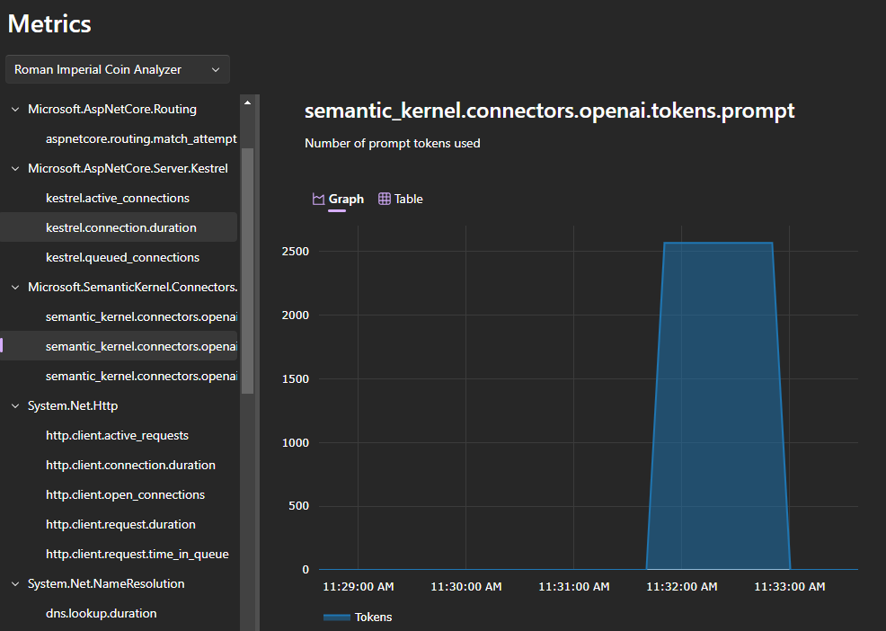
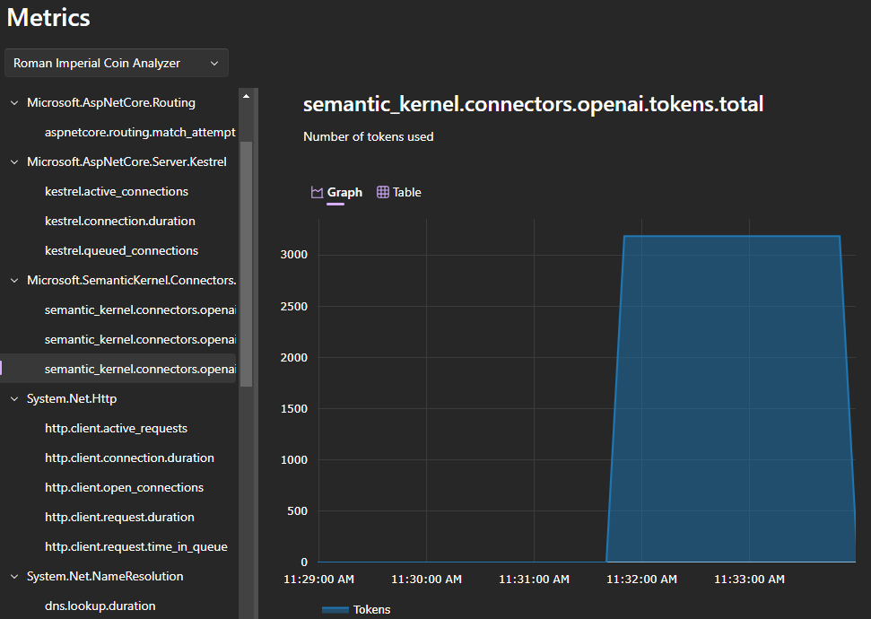

Testing
=============
* This repository provides a means to test out the API without the need to deploy the entire application stack.
* The deployment is done in similar manner as the full application stack but only deploys the Azure OpenAI Service.
* Docker is required to run the API and the Aspire Dashboard.
* Windows Subsystem for Linux (WSL) is recommended

## Tasks
* local:apply:          Applies Terraform configuration for Roman Imperial Coin Analyzer (local)
* local:down:           Destroys all resources and cleans up Terraform for Roman Imperial Coin Analyzer (local)
* local:run:            Starts Aspire Dashboard and compiles/runs API (local)
* local:up:             Creates a simple Azure environment for Roman Imperial Coin Analyzer (local)
* local:validate:       Runs the script ./scripts/validate.sh to test running API  (local)

### :heavy_check_mark: Steps
- :one: `task local:up`     - Build the environment 
- :one: `task local:run`    - Builds the API and Runs the Aspire Dashboard container
- :one: `task local:run`    - Build the environment 

## Example Deployment
```bash
➜  openai-coin-analyzer git:(main) ✗ task local:up
task: [local:up] terraform -chdir=./infrastructure/simple workspace new westus || true
Created and switched to workspace "westus"!

You're now on a new, empty workspace. Workspaces isolate their state,
so if you run "terraform plan" Terraform will not see any existing state
for this configuration.
task: [local:up] terraform -chdir=./infrastructure/simple workspace select westus
task: [local:up] terraform -chdir=./infrastructure/simple init

Initializing the backend...
Initializing modules...
- openai in ../modules/openai

Initializing provider plugins...
- Finding hashicorp/azurerm versions matching "~> 4.0"...
- Finding latest version of hashicorp/random...
- Finding latest version of hashicorp/http...
- Installing hashicorp/azurerm v4.22.0...
- Installed hashicorp/azurerm v4.22.0 (signed by HashiCorp)
...
azurerm_role_assignment.local_user_openai_user: Creation complete after 26s [id=/subscriptions/ccfc5dda-43af-4b5e-8cc2-1dda18f2382e/resourceGroups/seagull-23461-app_rg/providers/Microsoft.CognitiveServices/accounts/seagull-23461-openai/providers/Microsoft.Authorization/roleAssignments/0103acb2-3e57-0f26-11f9-c9d6041acd21]

Apply complete! Resources: 7 added, 0 changed, 0 destroyed.

Outputs:

APP_NAME = "seagull-23461"
APP_RESOURCE_GROUP = "seagull-23461-app_rg"
OPENAI_ENDPOINT = "https://seagull-23461-openai.openai.azure.com/"
```

## Example Validation
* Open two terminal windows or split tabs
* Validation will open the Aspire Dashboard in Google Chrome

### Terminal 1
```bash
➜  openai-coin-analyzer git:(main) ✗ task local:run
task: [local:aspire] docker run --rm -p 18888:18888 -p 4317:18889 -d --name aspire-dashboard  mcr.microsoft.com/dotnet/aspire-dashboard:8.1.0 > /dev/null 2>&1 || true
task: [local:run] RIC_AOI_ENDPOINT=https://seagull-23461-openai.openai.azure.com/ dotnet run
info: Program[0]
      OpenTelemetry configured with Azure Monitor
LogRecord.Timestamp:               2025-03-07T17:29:43.0573906Z
LogRecord.CategoryName:            Program
LogRecord.Severity:                Info
LogRecord.SeverityText:            Information
LogRecord.FormattedMessage:        OpenTelemetry configured with Azure Monitor
LogRecord.Body:                    OpenTelemetry configured with Azure Monitor
LogRecord.Attributes (Key:Value):
    OriginalFormat (a.k.a Body): OpenTelemetry configured with Azure Monitor             
  ...
info: Microsoft.AspNetCore.Hosting.Diagnostics[2]
      Request finished HTTP/1.1 POST http://localhost:8080/analyze - 200 - application/json;+charset=utf-8 20797.0848ms
LogRecord.Timestamp:               2025-03-07T17:31:41.9378741Z
LogRecord.TraceId:                 1eaef686e791aec66ee4f24037d95549
LogRecord.SpanId:                  9a1fc2ef10abf44c
LogRecord.TraceFlags:              None
LogRecord.CategoryName:            Microsoft.AspNetCore.Hosting.Diagnostics
LogRecord.Severity:                Info
LogRecord.SeverityText:            Information
LogRecord.FormattedMessage:        Request finished HTTP/1.1 POST http://localhost:8080/analyze - 200 - application/json;+charset=utf-8 20797.0848ms
LogRecord.Body:                    Request finished {Protocol} {Method} {Scheme}://{Host}{PathBase}{Path}{QueryString} - {StatusCode} {ContentLength} {ContentType} {ElapsedMilliseconds}ms
LogRecord.Attributes (Key:Value):
    ElapsedMilliseconds: 20797.0848
    StatusCode: 200
    ContentType: application/json; charset=utf-8
    Protocol: HTTP/1.1
    Method: POST
    Scheme: http
    Host: localhost:8080
    PathBase:
    Path: /analyze
    QueryString:
    OriginalFormat (a.k.a Body): Request finished {Protocol} {Method} {Scheme}://{Host}{PathBase}{Path}{QueryString} - {StatusCode} {ContentLength} {ContentType} {ElapsedMilliseconds}ms
LogRecord.EventId:                 2
LogRecord.ScopeValues (Key:Value):
[Scope.0]:ConnectionId: 0HNATJNG4GR77
[Scope.1]:RequestId: 0HNATJNG4GR77:00000001
[Scope.1]:RequestPath: /analyze  
```

### Terminal 2
```bash
➜  openai-coin-analyzer git:(main) ✗ task local:validate
task: [local:validate] bash ./validate.sh
*   Trying 127.0.0.1:8080...
* Connected to localhost (127.0.0.1) port 8080 (#0)
> GET / HTTP/1.1
> Host: localhost:8080
> User-Agent: curl/7.81.0
> Accept: */*
>
* Mark bundle as not supporting multiuse
< HTTP/1.1 200 OK
...
* Connection #0 to host localhost left intact
{
  "requestId": "f97cd535-0f7d-460b-834b-38837222a407",
  "file": "coin.png",
  "result": "* The coin is an Antoninianus and it is likely from one of the primary Roman mints, but without a specific mint mark, the exact mint cannot be determined. The year of minting is not specified, but based on the style and fabric, this coin likely dates to the mid-3rd century.\n\n* The exact diameter and weight are not provided, but typically an Antoninianus would have a diameter of around 21-24 mm and would originally weigh in the vicinity of 5 grams, although it could vary over time. \n\n* The obverse side of the coin features a right-facing portrait of the Emperor with a radiate crown, which suggests it is an Antoninianus. The surrounding inscription, although not fully visible, would typically include the Emperor's name and titles. \n\n* 
  ...
}
```

## Aspire Dashboard
* The Aspire Dashboard is a tool for monitoring and debugging OpenTelemetry applications.
* The dashboard provides a user interface for viewing and analyzing telemetry data, including traces, metrics, and logs.

### Example Screenshots




# Navigation
[⏪ Previous Section](../docs/code.md) ‖ [Return to Main Index 🏠](../README.md) ‖
<p align="right">(<a href="#lets-encrypt-tls-certificates">back to top</a>)</p>